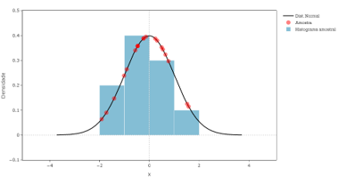

# Forma das distribuições!

     

Este app foi criado para auxiliar no curso de validação de curvas de calibração. Especificamente, para apresentar o formato das diferentes distribuições que existem (mais utilizadas).

Cada distribuição é apresentada em uma página diferente, sendo possível alterar seus parâmetros (`loc`, `scale`, etc) através de inputs. Também é possível adicionar uma amostra proveniente da distribuição em questão, variando seu tamanho e semente de aleatorização. A amostra é inseria sob a curva da distribuição, sendo adicionado o histograma de densidade da amostra.

 

 

Por enquanto, estão adicionadas as seguintes distribuições:

- Normal;
- Exponencial;
- Uniforme;

## Licença

